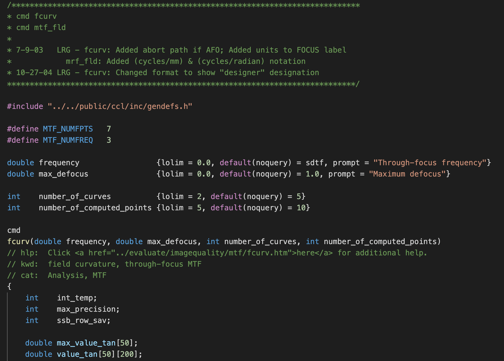

# OSLO CCL macro language support for Visual Studio Code

This extension adds syntax highlighting for [OSLO(Optics Software for Layout and Optimization)](https://www.lambdares.com/oslo/) CCL scripts.

## Screenshot

## Note
OSLO CCL/SCP are based on the C programming language.
This extension is therefore essentially derives from [C/C++ syntax](https://github.com/jeff-hykin/cpp-textmate-grammar/) settings.

## Changelog
Read the [CHANGELOG](CHANGELOG.md) to know what has changed over the last few versions of this extension.

## License
This extension is licensed under the MIT License - see the [LICENSE](LICENSE) for details.

## Contributing
Contributions are greatly appreciated. Please fork this repository and open a pull request to add snippets, make grammar tweaks, etc.